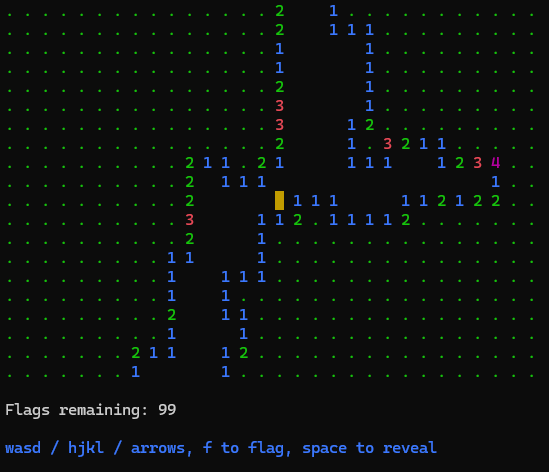

# Minesweeper



We made this in class! Run the following to get started:

```sh
git clone https://github.com/sf-edu/csci-105-2025-fall-minesweeper.git minesweeper
cd minesweeper
dotnet run
```

## License

This demo is distributed under [MIT](./LICENSE.md).